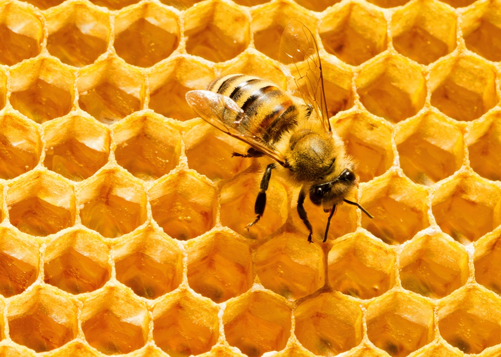
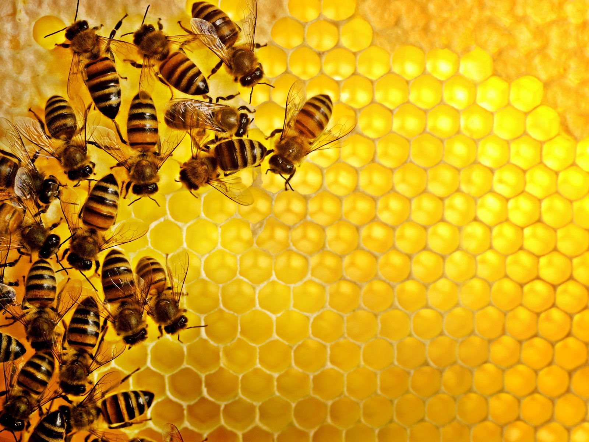
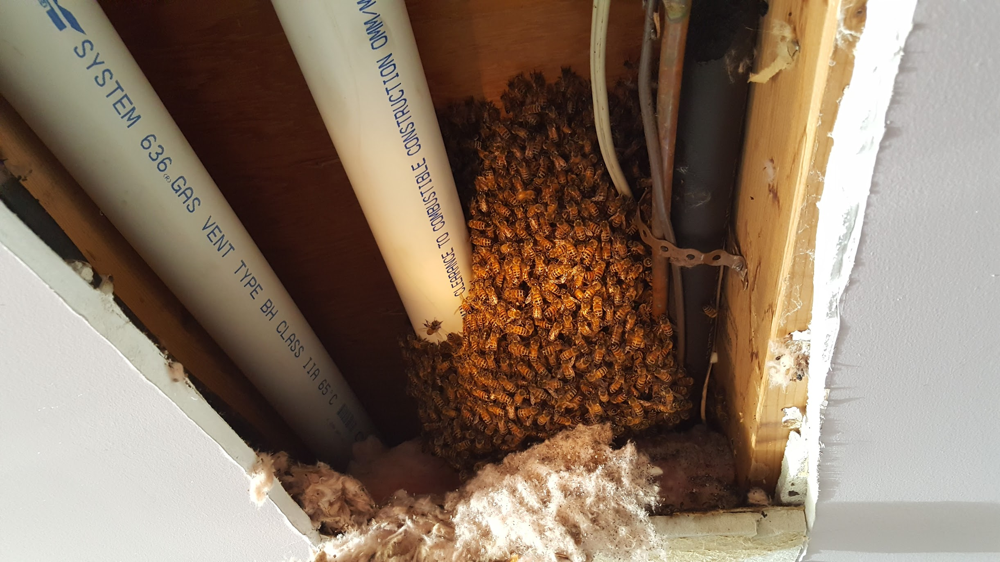
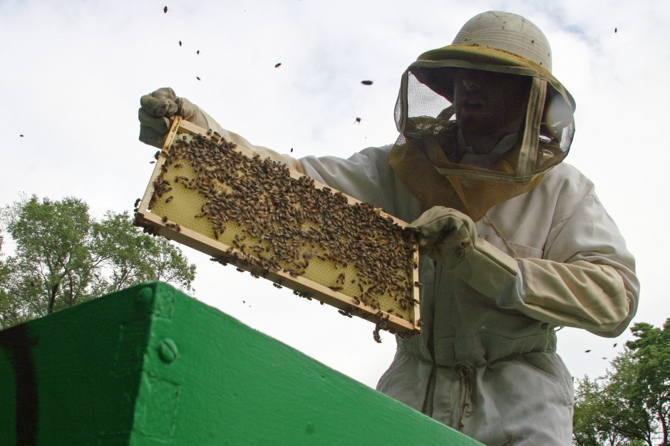

# Hobbyist Beekeeping

---

## Who am I?
### Beekeeping in Ontario

^ Chris Inch - Beekeeping in Ontario Blog

^ By day I work at Shopify Plus in Waterloo as an Engineering Lead

^ Started beekeeping in 2011

^ Currently I only have one colony

---

## Five mind-blowing facts

---

#### **ONE**
## Only female bees can sting

^ Only female bees can sting. This is true because the stinger is part of the female egg-laying anatomy and obviously males don’t have this.

---

#### **TWO**
## Any female egg can become queen

^ There are 3 main types of bees in the hive: Queen - female, Workers - female, and Drones - male.

^ Any female egg can be made into a queen by feeding it royal jelly in a vertical cell. Beekeepers exploit this and can create mass quantities of queens.

---

#### **THREE**
## It takes 12 honeybees to make 1 teaspoon of honey

^ One single honeybee creates only 1/12th of a teaspoon of honey in her lifetime. Yet, a single colony could potentially make between 100 - 200 pounds of honey in a single year.

---

#### **FOUR**
## All females can lay eggs

^ This may seem obvious… but perhaps not… because most people understand that the Queen is the one that lays eggs… While the queen is in the hive, she actually emits a pheromone that inhibits all of the other females/workers from laying eggs. This causes an interesting situation if the queen is killed or lost. Laying-workers is a situation where workers start laying eggs in the hive because there is no queen present. However… the caveat here is that all of the eggs will be unfertilized…. What does that mean? …. well...

---

#### **FIVE**
## Drones come from unfertilized eggs

^ Unfertilized eggs become male bees. This is true of all male bees in the hive. Male bees have no father (but they do have a grandfather). The queen decides to lay an unfertilized egg (male) or an fertilized egg (male).

---
​
## HOBBYIST BEEKEEPING
### **KEEP BEES**
### **FOR THE SAKE OF KEEPING BEES**

^ The main reason I keep bees is for the sake of keeping bees.

^ I don't sell honey.

^ Similar to backyard gardening. It's a hobby, not a livelihood.

---

# [fit] Rural vs. Urban

^ There are lots of debates on rural vs urban beekeeping

^ Many would argue that urban beekeeping is going to be what saves bees

^ Urban areas have fewer pesticides and forage available from spring to winter.

---

> "If you have space for a backyard composter, you have space for a hive"
-- Keeping Bees in Towns and Cities

^ A book by Luke Dixon

---

# [fit] A quick lesson

^ Let's have a quick lesson on honeybees in general.

^ What's going on inside the hive.

---

# [fit] HONEYBEES

- QUEEN
- DRONES
- WORKERS

^ Queens can sting multiple times. Mother to the colony.

^ Drones come from unfertilized eggs. They have no father. But do have grandfathers. (Figure that out.)

^ Workers/females do all the work in the hive. Nurse, guard, forage.

---

# [fit] BIRTH OF A HONEYBEE

- **Queen** 16 days
- **Worker** 21 days
- **Drone** 24 days

^ From egg to emerging bee, this is the timeline for each of the types of bees

---

# [fit] How do I become
# [fit] a **Hobbyist Beekeeper**?

^ So you may be thinking about doing this. Great. Here's what you need to do.

---

## [fit] Get bees

- Nuc (Nucleus)
- Capture a swarm
- Split a hive
- Packaged bees
- Cut out

^ Nucs are by far the easiest way to obtain bees in this area.

^ Packaged bees are common in the US.

---

---

---

## [fit] CHOOSE HIVE STYLE

^ There are a few different hive styles. The main two styles commonly seen around here are Langstroth or Top Bar.

^ (Show real life examples of these types of hive styles in room)

---

# Langstroth

^ - Standard
- Easy
- Well supported
- Expensive
- Heavy lifting
- Perhaps not ideal for bees

---

# Top Bar Hive

^ - Cheaper
- DIY
- More natural for bees
- Messy / difficult
- Definitely more intimidating.

---

## Other equipment

- Veil
- Jacket, suit
- Gloves _(optional)_
- Smoker
- Hive tool
- Log book

^ Veil is important so you don't get stung in the eyeballs.

^ I started with gloves but prefer no gloves unless things get crazy.

---

## [fit] Next steps

- Order bees early
- Get your equipment
- Assemble your equipment

^ And then you....

---

# [fit] Wait...

^ Playing the waiting game is like waiting for a child to be born.

^ You get all ready and then you wait for "the call"

---

# Install your bees

^ Installing your bees will depend on the way you aquired them.

^ Nucs are easy. Cut-outs are hard. Everything else is in between.

---

# After installation

- Monitor progress of colony
- Feed bees when necessary
- Allow the colony to build
- Don't inspect too frequently
- Ensure the colony is healthy

---

# During the summer

- Monitor population and comb creation
- Add more room when necessary
- Watch for pests & diseases
- Look for queen (or eggs)
- Repair and trim comb

---

# Over winter

- Bees do not hibernate
- Bees survive cold
- Moisture can kill
- Ventilate
- Wrap hives (maybe)
- **Leave them alone**

---

# [fit] Rules and regulations

---

# [fit] Check locally

Every city may have their own bi-laws

# [fit] ONTARIO BEES ACT

Register with Ministry of Agriculture

---
​
# [fit] So how do I start?

- Books
- Videos
- Forums
- Associations

**What works best for you?**

^ Find resources around you. Libraries are good.

^ Talk to other beekeepers

^ Decide _why_ you want to keep bees. Then figure out what you need to do.

---

**BLOG**
BEES.CHRISINCH.COM
​
**EMAIL**
BEES@CHRISINCH.COM

**TWITTER**
@BEEKEEPINGON
