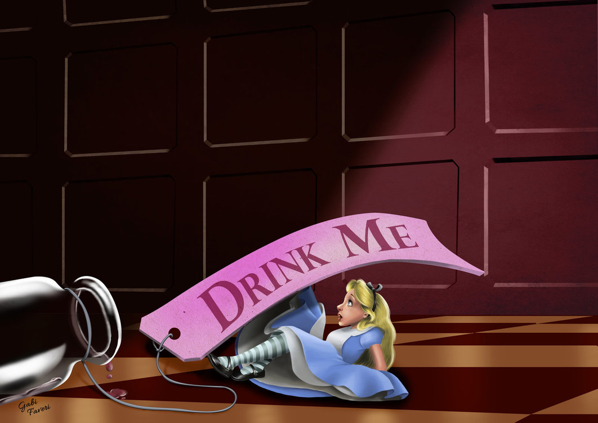
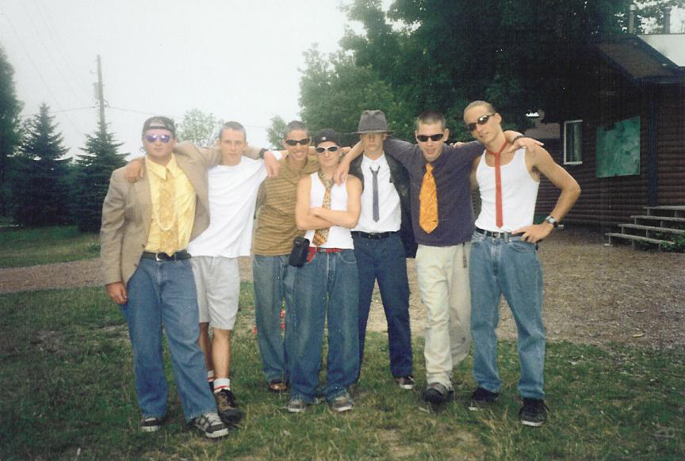
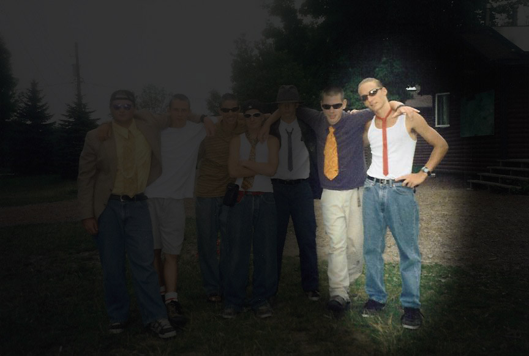
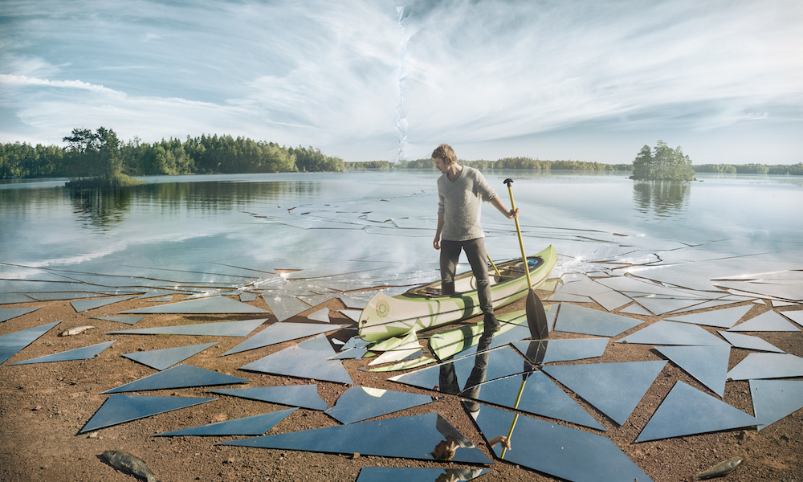
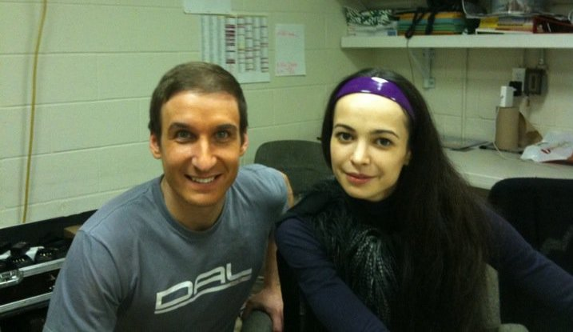
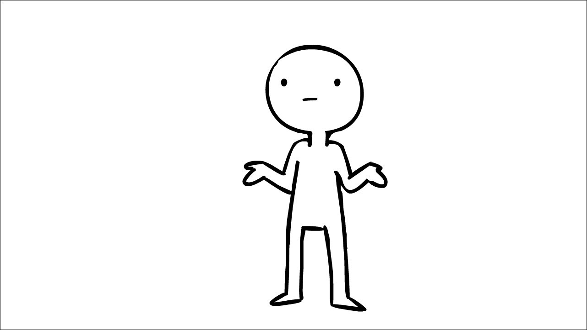
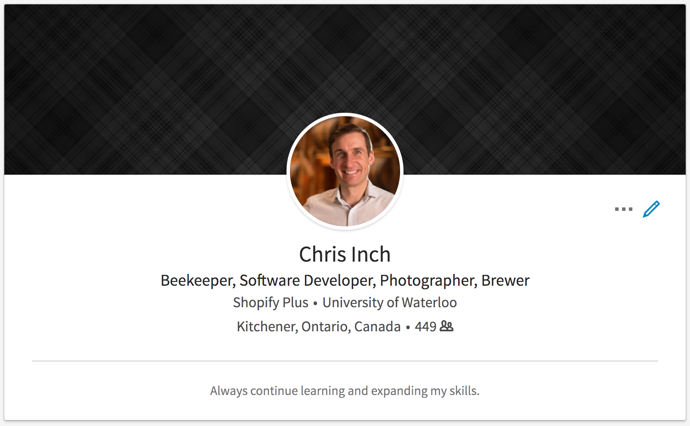
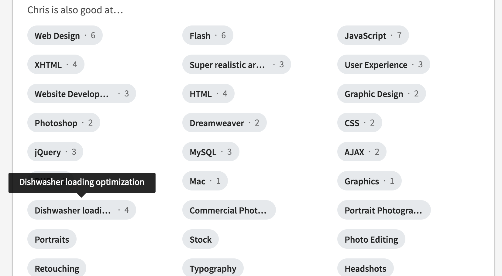
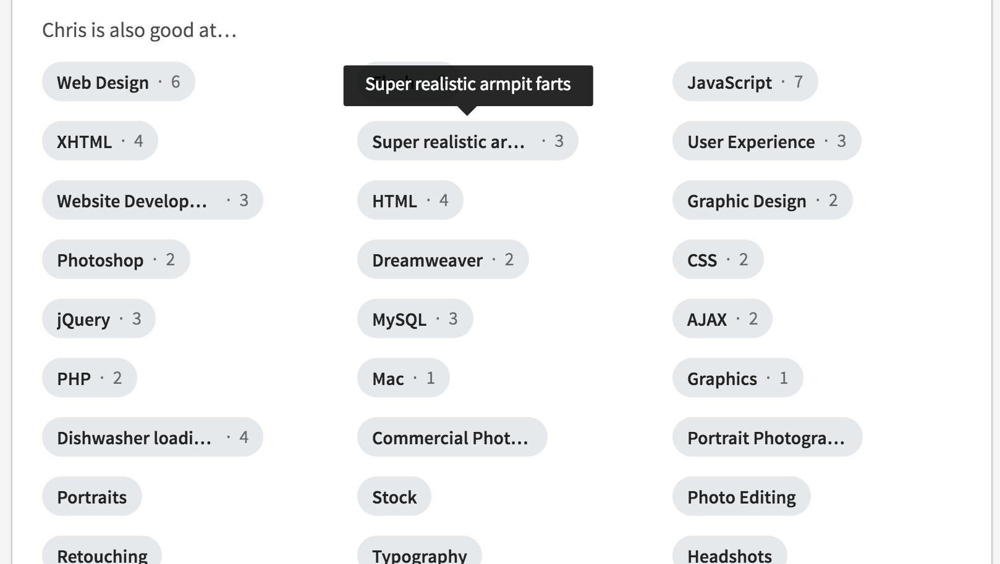

# [fit] Making yourself uncomfortable

### and the future of armpit farts

^ Struggled with whether to do the armpit farts first to grab your attention or last to build suspense.

^ Decided to keep them till the end.

^ There will be armpit farts.

---

# [fit] Chris Inch

Senior Engineering Lead @ Shopify
chrisinch.com

^ Introduce Shopify

---

She drank from a bottle called DRINK ME
And up she grew so tall,
She ate from a plate called TASTE ME
And down she shrank so small.
And so she changed, while other folks
Never tried nothin’ at all.

**Alice** - _by Shel Silverstein_

---

^ This is a picture of me when I was 16 years old. I was a camp counsellor.

---

^ More specifically, _this_ is me.

^ Share a story about this summer

^ I was away from my own parents and also looking after children

^ We had a full 5 days of training and then we were set loose

^ 2nd day at dinner, kid – *Justin* – gets up and leaves the table.

^ I got this.

^ Justin walks back to the cabin, grabs his hockey bag.

^ Starts walking.

^ I got this.

^ I've got minutes upon minutes of experience with this sort of thing.

^ Justin keeps walking.

^ Where are you going? Home. Guelph. 50 Km away.

---

^ I used everything I could think of to get this kid back

^ He was stubborn

^ Consider I've only been a counsellor for less than 48 hours.

^ We got Justin's parents on the phone, but he wouldn't talk to them.

^ Eventually, we put Justin in a van and drove him back home.

^ We walked nearly 8Km that night.

---

^ 20 years later, I still remember this day as though it was yesterday

^ Reflecting on this experience allows me to inform my future decisions.

^ Why is this memory so vivid? Because I was _way_ out of my comfort zone.

^ I was...

---

# [fit] Unfamiliar

^ Unfamiliar with the situation. (It had never happened to me before)

---

# [fit] Uncertain

^ Uncertain of the outcome. (I had no idea where it would go)

---

# [fit] Uncomfortable

^ Out of my comfort zone.

^ Unfamiliar, uncertain, uncomfortable

^ This is what I'd like to discuss with you today

---

^ Time for some reflection

^ Think back to one of your most vivid memories. Good, or bad.

^ Chances are, this memory was formed by a situation where you were unfamiliar, uncertain, uncomfortable

^ New experiences, challenging times, a time where you were out of your comfort zone.

---

## [fit] Unfamiliar

## [fit] Uncertain

## [fit] Uncomfortable

^ So why is this important? What does it mean?

^ The times when you are most uncomfortable shape who you are.

^ You gain data/information to inform future decisions. This is highly valuable.

---

## The times when you are

# _**uncomfortable**_

## shape who you are

^ Your memories are proof of this.

^ Times that are _normal_ and _comfortable_ won't stick.

^ *Be comfortable being uncomfortable*

---

^ I put this slide in here to give you some time to reflect on this for a minute.

^ Think back to the biggest moments in your life that have shaped you.

^ You can write this down and *share* if you'd like to.

---

# So...

^ Where to from here?

^ Another story...

---

^ In 2011, driving in Ottawa, heard radio for open-casting call for extras (supers) in a ballet at the National Arts Centre

^ Mariinsky ballet company (formerlly Kirov)

^ No experience necessary.

^ Driving in the car, I thought: Neat! I should try this.

---

^ This is me with Diana Vishneva back stage.

^ Diana is arguably the best ballet dancer in the entire world – I did not know this at the time.

^ Took a week off work. Rehearsals, and six performances with the Mariinsky Ballet

^ Definitely an experience that was unfamiliar to me.

^ Uncertain going to casting call? Was I going to have to dance? Know ballet?

^ 100% out of my comfort zone. You can see I still had stage makeup on my face.

^ **How did this happen?**

---

## Don't ask why, ask

# _**why not?**_

^ You've likely heard this type of thing before

^ Don't regret the things you have done. Regret the things you didn't do.

^ But _really_ this is the most important point to drive home here.

^ Why not?!

---

# [fit] Recap

---

### 1. Be comfortable being uncomfortable

### 2. Ask yourself "why not"

^ If we all embrace that being uncomfortable shapes who we are

^ It should be our goal to stay uncomfortable

^ Do this by asking yourself "why not" more often than "why"

^ Missed opportunities are hard to recognize.

---

^ Slide is here for a mental break.

^ Stand up and stretch. Or not.

^ Only regret the things you didn't do.

---

# Don't take yourself too seriously

^ OK, onto the next topic.

^ When you face challenges, you may be holding yourself back.

^ We all care about what other people think. But this does more harm than good.

^ When asking "why not", if you're too concerned about other people you forget about yourself.

---

^ I worked with a guy who used to say I had a horseshoe up my ass.

^ For those missing the reference, it meant I was lucky.

^ Is a dandelion seed lucky? No, there are hundreds of seeds per plant.

^ More opportunities and successes when you try more things.

^ *story*: In 2015, I was CTO of a software company in Ottawa...

---

^ Here's my LinkedIn profile. The picture is the most recent thing.

^ Otherwise it hasn't been updated in years.

^ It's not a typical "resume".

---

^ In some of my skills, I've dropped a few nuggets for those willing to looking

^ "Dishwasher Loading Optimization" is something I take pride in.

^ I look for ways to become better at things. More on this in a bit.

---

^ Oh, and then there's this.

^ In the spirit of not taking myself too seriously I have this on my LinkedIn.

^ This is actually true. I can make armpit farts that sound super real.

^ Talk about high school pranks?

---

# Aim for mastery

^ This is the last point I want to drive home today.

^ Don't settle for the status quo.

^ Convince yourself that you can always improve. Then you will.

---

### 1. Be comfortable being uncomfortable

### 2. Ask yourself "why not"

### 3. Don't take yourself too seriously

### 4. Aim for mastery

^ OK. I'm going to leave this up on the screen and dive into the real reason you're here.

^ Armpit farts.

---

She drank from a bottle called DRINK ME
And up she grew so tall,
She ate from a plate called TASTE ME
And down she shrank so small.
And so she changed, while other folks
Never tried nothin’ at all.

**Alice** - _by Shel Silverstein_

^ Back to first slide. Reflect on this a bit.

^ What have you tried? What have you avoided?

^ (Discussions and questions)
